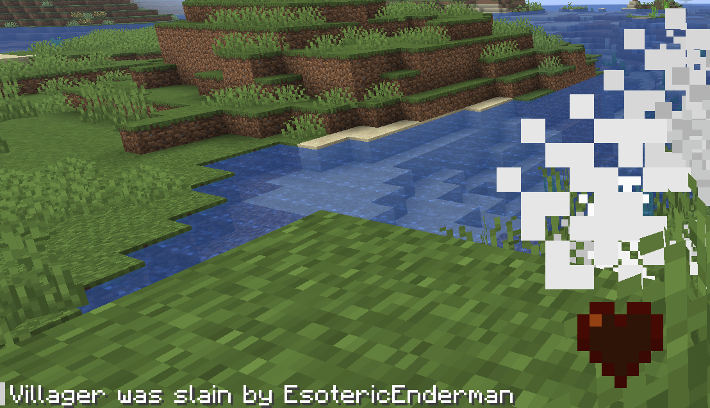
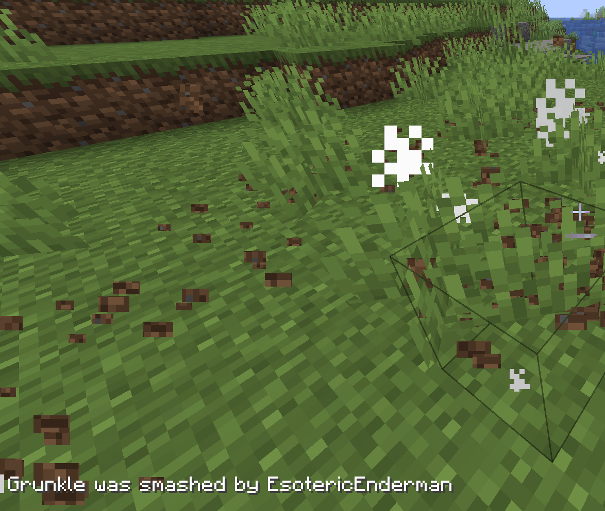
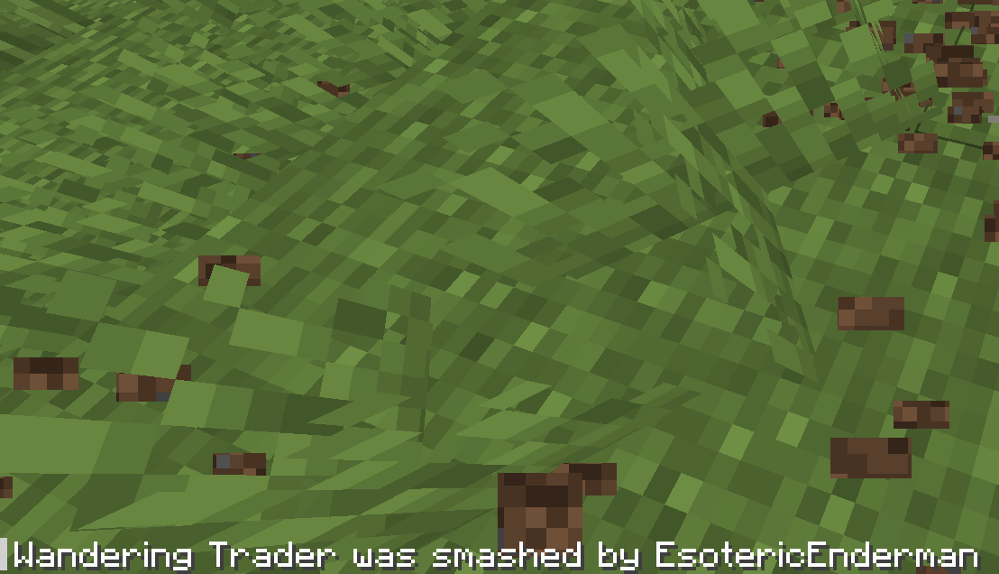
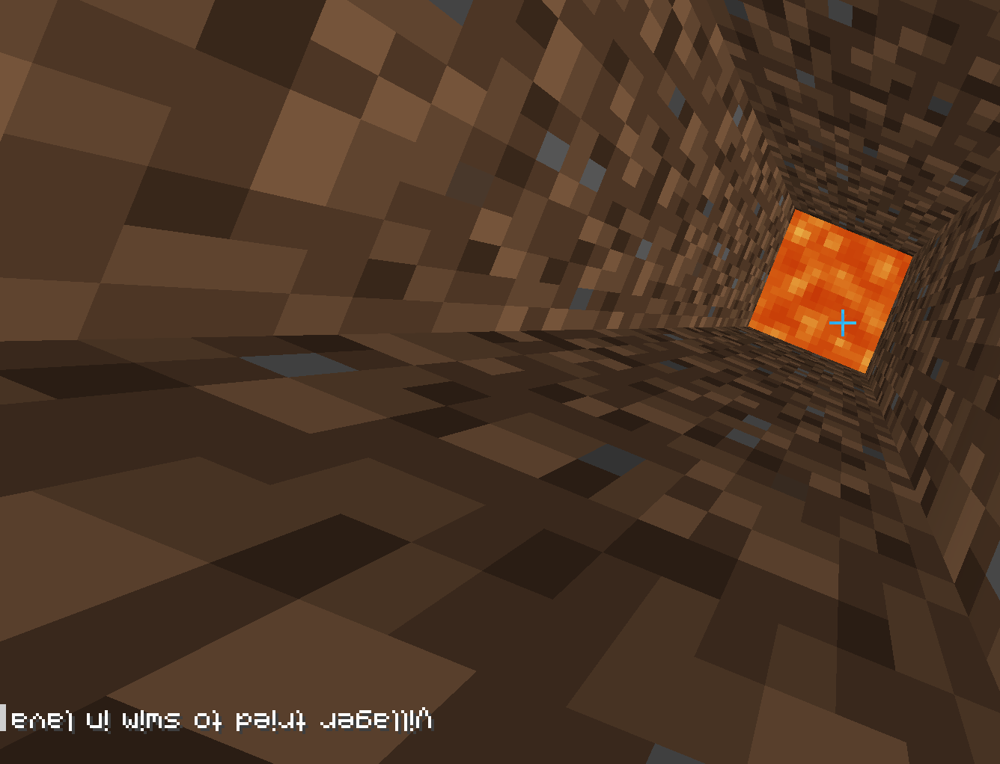
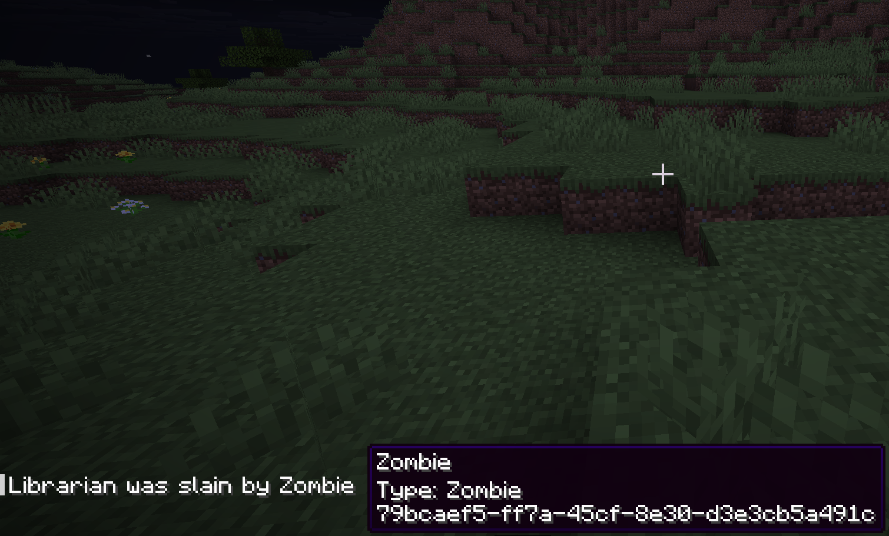
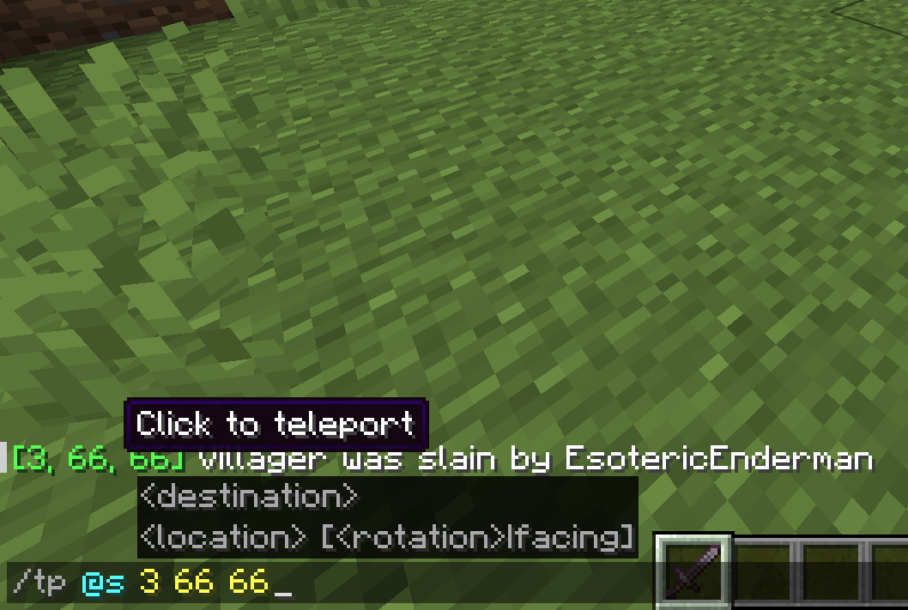

# Gallery

## Notable Deaths Logo

The logo of this project.

## Normal Death Message

Death message being displayed for a villager, server using the default configuration.

## Named Entity Death Message

A death message being displayed for a named entity.

## Death Message Support

All vanilla death messages are supported.

## Language Support

This plugin uses Minecraft's localization, meaning all languages are supported, even weird ones.

## Metadata in Messages

Entity metadata can be seen in the death messages.

## Location Messages

Death locations can also be announced in chat.

